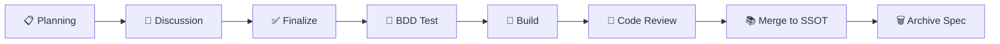

# Repository Management in the Age of Agent Coding

## Core Philosophy

Agent Coding is changing how repositories are organized. When LLMs become the primary code producers, repository structure, documentation standards, and task tracking all need to be redesigned — with the goal of enabling Agents to **autonomously understand context, correctly execute tasks, and remain traceable and auditable**.

---

## 1. Monorepo: Single Repository Management

### Why Monorepo

In the Agent Coding scenario, the advantages of Monorepo are amplified:

| Advantage | Description |
|------|------|
| **Unified Context** | An Agent can access all frontend, backend, big data, and Agent service code in a single session without piecing together understanding across repositories |
| **Atomic Changes** | A single API change can simultaneously modify the interface definition, frontend calls, database migration, and test cases in one PR |
| **Shared Harness** | AGENTS.md, lint rules, and CI configuration are maintained in one place, automatically inherited by all sub-projects |
| **Dependency Visibility** | The model can directly read the dependency graph, avoiding destructive changes caused by hidden cross-repo dependencies |

### Typical Structure

```
monorepo/
├── apps/
│   ├── web/                # Frontend application
│   ├── api/                # Backend service
│   ├── agent-service/      # Agent orchestration service
│   └── data-pipeline/      # Big data ETL
├── packages/
│   ├── shared-types/       # Shared type definitions
│   ├── auth-sdk/           # Authentication SDK
│   └── logger/             # Unified logging
├── docs/
│   ├── domains/             # Domain-based single source of truth
│   │   ├── order/           # Order domain
│   │   │   ├── index.md     # Domain overview
│   │   │   ├── schema.md    # Data model
│   │   │   ├── state.md     # State machine definition
│   │   │   ├── flow.md      # Business process
│   │   │   ├── api.md       # Interface contract
│   │   │   └── bdd.md       # Behavioral specification
│   │   ├── payment/         # Payment domain
│   │   └── user/            # User domain
│   ├── specs/               # Feature specifications (temporary, archived or destroyed when complete)
│   ├── architecture.md      # Global architecture document
│   └── conventions.md       # Coding conventions
├── AGENTS.md               # Agent global instructions
├── CLAUDE.md               # Claude-specific instructions (optional)
└── nx.json / moon.yml      # monorepo tool configuration
```

### Agent-Friendly Monorepo Practices

1. **Place AGENTS.md in the root directory** — the first entry point when an Agent enters the repository, describing the overall architecture, sub-project responsibilities, and dependency directions
2. **Each sub-project has its own README** — including the module's boundaries, public interfaces, and local startup commands
3. **Unified lint + format configuration** — Agents don't need to guess code style
4. **Explicit dependency declarations** — workspace dependencies in `package.json` or `Cargo.toml` so the model understands the impact scope of changes

> **Anti-pattern**: Under polyrepo, Agents need to switch context between multiple repositories, losing session state with each switch. For a PR that requires changes to 3 repositories, an Agent can barely complete it independently.

---

## 2. Documentation First: Planning → Discussion → Finalize → BDD Test → Build

### Process Overview



This is an intensified version of traditional software engineering's "design first" approach for the Agent era. **Core difference: documentation is co-produced by humans and Agents through discussion, serving both human understanding and Agent execution.** Documentation is the collaboration interface.

### Detailed Breakdown of Each Stage

#### Planning

Produce a structured requirements document and place it in the `docs/specs/` directory.

```markdown
# docs/specs/user-export-v2.md

## Background
The current user data export feature only supports CSV. Users need Excel and PDF formats.

## Goals
- Support xlsx and pdf export
- Export file size limit of 100MB
- Asynchronous processing with email notification upon completion

## Modules Involved
- `apps/api/` — New export task queue
- `apps/web/` — Export button UI redesign
- `packages/shared-types/` — Export task type definitions

## Constraints
- Must reuse existing queue infrastructure (BullMQ)
- File storage uses existing S3 bucket
```

> Agents can directly read this document to understand the full scope of the task, rather than relying on vague natural language instructions.

#### Discussion

Team members (humans and Agents) discuss around the Planning document, with output focused on:
- Technical solution choices and tradeoffs
- Edge cases and exception handling
- Compatibility with existing systems

Discussion results are written into the spec document as comments or appended paragraphs.

#### Finalize

Merge the discussion conclusions into the spec and mark it as `status: finalized`. At this point, the document becomes the Agent's execution blueprint.

#### BDD Test Prepare

**Before writing any implementation code, write tests first.** This isn't TDD dogma — it's a core practice of Harness Engineering:

```gherkin
# tests/features/user-export.feature

Feature: User Data Export v2

  Scenario: Export in Excel format
    Given the user has 500 records
    When the user selects "xlsx" format and clicks export
    Then the system creates an async export task
    And sends an email notification when export is complete
    And the downloaded file is a valid xlsx format

  Scenario: Exceeding size limit
    Given the user has more than 100MB of data
    When the user clicks export
    Then the system returns an error message "Export data too large, please narrow the filter scope"
```

> Agents can directly generate BDD tests from the finalized spec. Tests-first means Agents have clear verification targets during the Build phase — the feedback loop is closed from the very beginning.

#### Build

Agents implement based on spec + BDD test. Because there's clear documentation and tests, Agents can:
- Know which modules to change (declared in the spec)
- Know what the correct output is (defined by BDD tests)
- Automatically run tests for verification (feedback loop closes automatically)

#### Merge into SSOT & Spec Cleanup

After Build is complete and code review passes, execute two key actions:

**1. Merge knowledge from the spec into the Single Source of Truth**

Specs are temporary documents; knowledge must be consolidated into domain-organized persistent documents. Each domain directory maintains a standard set of documents:

| File | Responsibility | Content Example |
|------|------|----------|
| `index.md` | Domain overview, module boundaries, core concepts, relationships with other domains | Order domain includes four sub-domains: ordering, payment, fulfillment, refund |
| `schema.md` | Data model, entity definitions, field meanings, constraints | Order entity includes items, status, totalAmount fields |
| `state.md` | State machine, state definitions, transition rules, guard conditions | created → paid → shipped → delivered → completed |
| `flow.md` | Business processes, end-to-end business scenario descriptions | Order flow: create order → inventory deduction → payment → shipping |
| `api.md` | Interface contracts, API definitions, request/response formats, error codes | POST /api/orders, request body, response body, error code enumeration |
| `bdd.md` | Behavioral specifications, behavioral tests for key business rules | Auto-cancel unpaid orders after timeout, rollback on insufficient inventory, etc. |

Why not ADR (Architecture Decision Records)?

ADRs record "decisions" — why option A was chosen over option B. They're suitable for one-time recording but **not suitable as a continuously updated knowledge source**. What Agents need isn't "why this decision was made" but "what the current system looks like." `index.md` + `schema.md` + `state.md` + `flow.md` + `api.md` + `bdd.md` describe the current true state of the system, continuously updated with each spec merge.

**2. Destroy or archive the spec document**

Once the spec has fulfilled its purpose, it must not remain in `docs/specs/`. Residual specs cause information conflicts — Agents may read outdated specs and ignore the latest knowledge already merged into the SSOT.

```
# Spec lifecycle
docs/specs/user-export-v2.md
    ↓ Finalize (as execution blueprint)
    ↓ Build + Code Review passed
    ↓ Knowledge merged into docs/domains/export/ documents
    ↓
    ✅ Completely delete the spec file
    or
    📁 Move to docs/specs/_archived/ (if decision context needs to be preserved)
```

The complete updated process:


---

## 3. Leveraging Skills to Carry Build Knowledge, Ops Knowledge, and Observability Practices

### The Problem: LLMs Don't Know How Your Team Works

LLMs know general best practices, but they don't know:
- What deployment process your team uses
- How your monitoring alerts are configured
- How your data pipelines run
- What internal tools and conventions you have

This knowledge previously lived in:
- Senior engineers' heads
- Outdated Wiki documents
- Slack history

### Skills as Knowledge Carriers

A Skill is a **structured, LLM-native knowledge container**. It encodes team-specific practices into instruction sets that Agents can directly invoke.

#### Example 1: Build Knowledge — Frontend Release Process Skill

```markdown
# skill: frontend-release

## Trigger Conditions
User requests "release frontend", "deploy frontend", "deploy web"

## Execution Steps
1. Run `nx run web:build:production`
2. Check bundle size; if main chunk exceeds 300KB, flag for optimization
3. Run `nx run web:test` to ensure all tests pass
4. Run `nx run web:lint` to ensure no lint errors
5. Create git tag `web-v{version}`
6. Push tag to trigger CI/CD

## Rollback
If issues are found after release:
1. `git revert` to previous tag
2. Re-execute steps 1-6
```

#### Example 2: Ops Knowledge — Database Migration Skill

```markdown
# skill: db-migration

## Trigger Conditions
User requests "add field", "modify table structure", "migration"

## Execution Steps
1. Create a new migration file under `apps/api/src/migrations/`
2. Migration file must include both `up` and `down`
3. `down` must safely rollback without data loss
4. For large tables (over 10 million rows), use batch migration strategy
5. Migration file naming format: `{timestamp}_{description}.ts`

## Prohibited Actions
- Never modify existing migration files
- Never introduce external API calls in migrations
- Never `DROP COLUMN` without data backup logic
```

#### Example 3: Observability Practices — Alert Configuration Skill

```markdown
# skill: alerting-setup

## Trigger Conditions
User requests "add alert", "configure monitoring", "set up alarm"

## Execution Steps
1. Confirm alert type (error rate / latency / throughput / saturation)
2. Define metrics based on SLI/SLO framework
3. Alert thresholds follow team standards:
   - P99 latency > 2s → P2 alert
   - Error rate > 1% → P1 alert
   - Error rate > 5% → P0 alert (phone call)
4. Route alerts to corresponding on-call channels
5. Every alert must include a runbook link

## Alert Template
... (attach team standard alert templates)
```

### Skill Maintenance Strategy

| Practice | Description |
|------|------|
| **Skills as Code** | Store in the repository under `.agents/skills/` or `.opencode/skills/`, version-controlled alongside code |
| **Code Review** | Skill changes go through PR review because they affect all Agent behavior |
| **Regular Calibration** | Monthly check whether Skills align with actual processes; outdated Skills are more dangerous than no Skills |
| **Layered Management** | Generic Skills (e.g., git operations) at global level; business Skills (e.g., order flow) at project level |

---

## 4. Task Progress Tracking in Markdown

### Why Markdown Instead of Issue Trackers

| Dimension | Issue Tracker (Jira/Linear) | Markdown Files |
|------|-----|------|
| Agent Accessibility | Requires API integration, invisible in Agent context | Directly readable, zero integration cost |
| Context Association | Issues separated from code | Co-located with code in the same repository; PRs can directly reference |
| Searchability | Requires Web UI | Agents can grep full-text search |
| Real-time Status | Status may lag | Every git push is the latest state |

### Implementation: Task Tracking in Markdown

Under the `docs/tasks/` directory, use Markdown files to track each task:

```markdown
# docs/tasks/user-export-v2.md

# User Data Export v2

- **Status**: In Progress
- **Assignee**: @agent + @alice
- **Spec**: [docs/specs/user-export-v2.md](../specs/user-export-v2.md)
- **Branch**: feat/user-export-v2

## Checklist

### Planning
- [x] Requirements document written
- [x] Affected modules confirmed

### Discussion
- [x] Technical solution review
- [ ] Performance metrics confirmed

### Finalize
- [ ] Spec marked as finalized

### BDD Test
- [ ] Export Excel test cases
- [ ] Export PDF test cases
- [ ] Large file limit test cases

### Build
- [ ] Backend export task queue implementation
- [ ] Frontend UI redesign
- [ ] Shared type definition updates
- [ ] Integration tests passing

## Notes

### 2026-03-28
- Discussion confirmed using BullMQ for async processing, no new dependencies
- File storage reuses existing S3 bucket `prod-user-exports`

### 2026-04-01
- Performance metrics pending confirmation: does it need to support concurrent exports?
```

### State-Driven Tracking Pattern

Each task file's lifecycle:

```
📋 Created → 🔍 Planning → 💬 Discussion → ✅ Finalized
    → 🧪 Testing → 🔨 Building → ✅ Done → 🗑️ Archived
```

Status is written directly in the Markdown file header. Agents can:
- Read the status field of all task files to generate progress reports
- Automatically update their own checklist items
- Reference task files in PR descriptions for automatic association

### Multi-Task View

Maintain a `docs/tasks/README.md` as an overview:

```markdown
# docs/tasks/README.md

# Task Board

## In Progress
| Task | Assignee | Stage | Last Updated |
|------|--------|------|----------|
| [User Export v2](./user-export-v2.md) | @alice + agent | Build | 2026-04-01 |
| [Payment Callback Refactor](./payment-callback.md) | @bob + agent | Testing | 2026-03-30 |

## Planning
| Task | Assignee | Stage | Last Updated |
|------|--------|------|----------|
| [Push Notification Service](./push-notification.md) | @charlie | Planning | 2026-04-02 |

## Done
| Task | Completed | PR |
|------|----------|-----|
| [Login Audit Log](./auth-audit.md) | 2026-03-25 | #142 |
```

> Agents can read this file at the start of each session to understand the progress of all current tasks.

---

## 5. Recommended Tools

### Monorepo Management

#### Nx

- **Website**: https://nx.dev
- **Best for**: TypeScript/JavaScript-heavy tech stacks with unified frontend/backend management
- **Core Strengths**:
  - Powerful dependency graph analysis — Agents can use `nx graph` to understand inter-module dependencies
  - Incremental builds and distributed caching — only build affected modules
  - Built-in task orchestration — `nx run-many --target=test --projects=affected` for batch execution
  - Rich plugin ecosystem — Next.js, NestJS, React, Express all have official support
- **Agent-Friendly Features**:
  - CLI output is structured and parseable by Agents
  - `nx show projects` lists all sub-projects
  - `nx affected` commands let Agents know which modules are affected by a change

```
# Typical nx.json project configuration
{
  "targetDefaults": {
    "build": {
      "dependsOn": ["^build"],
      "outputs": ["{projectRoot}/dist"]
    },
    "test": {
      "dependsOn": ["build"]
    }
  }
}
```

#### Moonrepo

- **Website**: https://moonrepo.dev
- **Best for**: Multi-language tech stacks (frontend TS + backend Rust/Python + big data PySpark)
- **Core Strengths**:
  - Language-agnostic — unlike Nx's JS ecosystem bias, moonrepo natively supports multiple languages
  - Hash-based incremental builds — unchanged inputs produce reused outputs
  - `.moon/toolchain.yml` for unified multi-language tool version management
  - Lighter configuration model — each project only needs one `moon.yml`
- **Agent-Friendly Features**:
  - `moon query projects` lists all projects and their dependencies
  - `moon run :lint :test` batch executes lint and test across all projects
  - Task dependency graph exportable as JSON, directly consumable by Agents

```yaml
# apps/api/moon.yml
tasks:
  build:
    command: cargo build --release -p api
    inputs:
      - "**/*.rs"
      - "Cargo.toml"
      - "Cargo.lock"
    outputs:
      - target/release/api
  test:
    command: cargo test -p api
    deps:
      - build
```

### Spec and Task Tracking Tools

#### Gemini Conductor (Google)

- **Best for**: Using Agents for task orchestration and tracking within the Gemini ecosystem
- **Core Strengths**:
  - Deep integration with Google ecosystem (BigQuery, GCS, GKE)
  - Supports Agent task decomposition, assignment, and progress tracking
  - Can track progress status of multi-Agent collaboration
  - Suitable for teams that need end-to-end tracking from "spec to deployment"

#### OpenSpec

- **Website**: https://openspec.dev
- **Best for**: Spec-centric development processes emphasizing documentation-driven workflows
- **Core Strengths**:
  - Spec documents as code — version-controlled in the repository
  - Supports spec discussion, approval, and change tracking
  - Can auto-generate BDD test scaffolds from specs
  - Integrates with CI/CD, spec status drives the build process

### Tool Selection Guide

| Scenario | Monorepo Tool | Spec Tool |
|------|--------------|-----------|
| Pure JS/TS stack, frontend + backend + Agent services | **Nx** | Gemini Conductor / OpenSpec |
| Multi-language stack (TS + Rust + Python) | **Moonrepo** | OpenSpec |
| Small team, quick start | **Nx** (lightweight mode) | Markdown + custom templates |
| Existing Google Cloud infrastructure | **Nx** or **Moonrepo** | **Gemini Conductor** |

> **What matters most is starting, not which tool you pick.** Choose one, get the process running, then adjust based on actual pain points. The Agent Coding toolchain is still evolving rapidly — maintaining a lightweight, switchable architecture is more important than picking the right tool.
