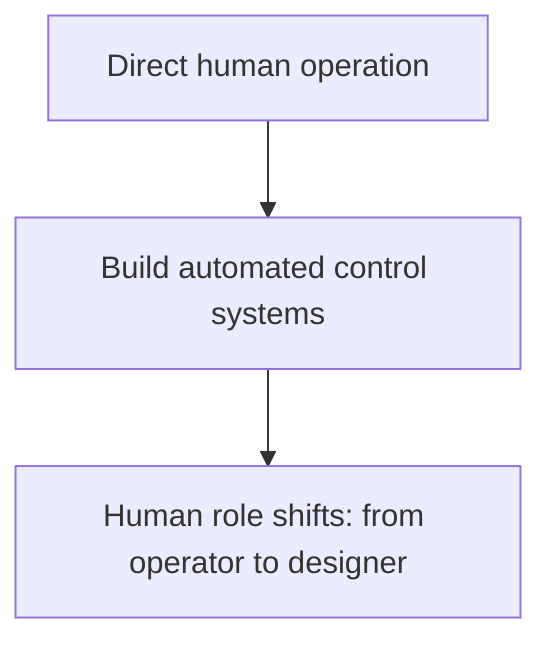
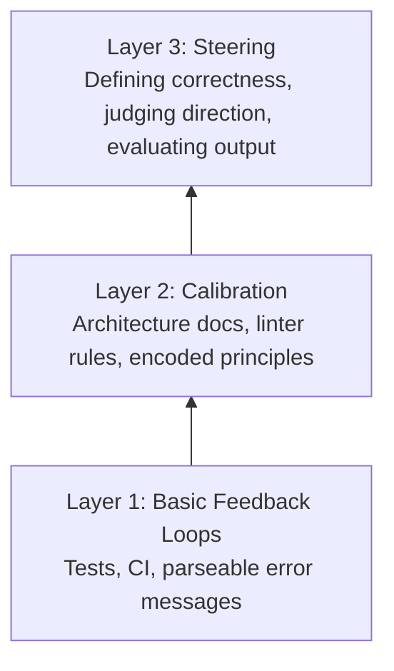
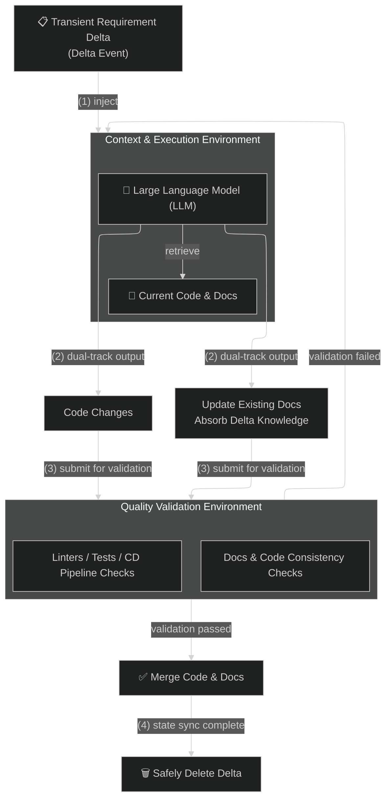

# Harness Engineering: When Cybernetics Meets Code

## 1. The Same Story, Three Times

### The 1780s: Watt's Governor

When the steam engine was first invented, a worker had to stand beside it, manually adjusting the valve to control the speed. The worker couldn't step away, couldn't lose focus.

Then Watt invented the **flyball governor**: a mechanical device that sensed rotational speed through centrifugal force and automatically adjusted the valve.

The worker disappeared. But a new role emerged: **the person who designs the governor.**

The work shifted from "turning the valve" to "designing the mechanism that makes the machine turn its own valve."

### The 2010s: Kubernetes

Before K8s, ops engineers manually restarted crashed services and manually scaled up and down. What K8s does is simple:

```
You declare: I need 3 replicas
The system observes: there are only 2
The system acts: automatically starts the 3rd
```

The engineer's work shifted from "restarting services" to "writing declaration files (specs) and letting the system maintain itself."

### Now: Harness Engineering

OpenAI described their engineering team: engineers almost never write code by hand anymore. What they do is:

- Design the runtime environment for Agents
- Build feedback loops
- Encode architectural constraints as machine-readable rules

Then they let the Agent write the code. They call this **Harness Engineering**.

### The Common Pattern Across All Three Stories



> Every time this pattern appears, it's because someone built sufficiently strong **sensors** (perceiving the current state) and **actuators** (correcting deviations) at that layer, enabling the feedback loop to close automatically at that level.

In 1948, Norbert Wiener gave this pattern a name: **Cybernetics**. The word derives from the Greek κυβερνήτης — helmsman. Kubernetes takes its name from the same word.

**You no longer turn the valve yourself. You steer.**

---

## 2. Feedback Loops in the Code World: What Exists and What's Missing

Software engineering has always had feedback loops, but they only operate at low levels:

| Feedback Loop | What It Detects | Level |
|----------|---------|------|
| Compiler | Syntax errors | Low |
| Linter | Code style | Low |
| Test suite | Whether behavior matches expectations | Low |

These are genuine automated control systems — but they can only check **mechanically verifiable properties**. Does it compile? Does it pass? Does it conform to style rules?

Everything above this had neither sensors nor actuators in the past:

- Does this change conform to the system architecture?
- Is this approach heading in the right direction?
- Will this abstraction become a burden as the codebase grows?

Only humans could answer these questions. Humans simultaneously served as sensors (judging quality) and actuators (writing fixes). The high-level feedback loops in the code world were **broken**.

---

## 3. What LLMs Changed

LLMs changed both sides simultaneously:

**Sensor side** — Models can understand code semantics, judging "does this change align with the project architecture" and "is this abstraction consistent."

**Actuator side** — Models can refactor modules, rewrite interfaces, and rebuild test suites around genuine contracts.

> **For the first time, feedback loops can automatically close at the level where important decisions are made.**

But closing the loop is a necessary condition, not a sufficient one. Watt's governor needed calibration. K8s controllers need correct specs. And LLMs need something even harder to provide.

---

## 4. The Two Layers of Harness Work

### Layer 1: The Basic Loop — Getting Feedback Running

This is the price of admission:

- Tests that Agents can run
- CI that can parse output
- Error messages that point toward fixes

A classic example: someone built a C compiler using 16 parallel Agents. The key wasn't how well the prompts were written, but the **carefully designed test infrastructure**.

> "I spent most of my effort designing the environment around Claude — tests, environment, feedback."

### Layer 2: Calibration — Turning Your Judgment into Machine-Readable Rules

This is where it gets truly difficult, and where most people get stuck.

"The Agent keeps doing the wrong thing. It doesn't understand our codebase."

This diagnosis is almost always wrong. The Agent isn't lacking capability — the knowledge it needs — what "good" looks like in your system, what patterns your architecture encourages, what patterns it avoids — **is locked in your head, and you haven't externalized it.**

Agents don't learn by osmosis. If you don't write it down, the 100th run makes the same mistakes as the first.

**The core work of Harness Engineering is making your engineering judgment machine-readable:**

- Architecture docs that describe the actual layering and dependency directions
- Custom linter rules with built-in fix guidance
- Golden Principles that encode the team's taste
- AGENTS.md, CLAUDE.md, .cursorrules — these aren't nice-to-haves, they ARE the Harness itself

The lesson from the OpenAI team: they used to spend 20% of every Friday cleaning up "AI-generated garbage code" — until they encoded their standards into the Harness.

---

## 5. The Penalty Multiplier

Documentation, automated testing, architectural constraint encoding — these practices have always been correct. Engineering books for the past thirty years have recommended them.

Most people skipped them because the cost of skipping was **slow and diffuse**: quality gradually degraded, onboarding new hires was painful, technical debt silently compounded.

Agentic Engineering makes the cost of skipping **extreme**:

| Skipped Practice | Traditional Cost | Agentic Cost |
|-----------|---------|-------------|
| No documentation | Slowly drifting off course | Agent ignores your conventions in every PR, at machine speed, around the clock |
| No tests | Feedback loop is broken | Feedback loop can't close at all |
| No architectural constraints | Tech debt slowly accumulates | Deviations compound faster than you can fix them |

And there's a trap: **you can't use Agents to clean up messes that Agents created — if the Agent doesn't know what "clean" looks like.**

Without calibration, the machine that creates the problem can't solve it either.

> The practices haven't changed. **The penalty for ignoring them has become unbearable.**

---

## 6. What Do You Need to Be Better at Than the Agent?

Generation-verification asymmetry: generating a correct solution is harder than verifying one.

You don't need to write faster than the machine. You need to be better at **judging** than the machine:

- Describing what "correct" looks like
- Identifying what's wrong with the output
- Judging whether the direction is right

The workers who designed Watt's governor didn't go back to manually turning valves. Not because they couldn't anymore, but because **it no longer made sense.**

---

## 7. Summary

```
Traditional Engineering: Humans write code, humans review code
                ↓
Harness Engineering: Humans design constraints, Agents write code, systems verify automatically

Human value shifts from "writing" to "defining what good writing looks like"
```

The three-layer capability model of Harness Engineering:



> **You no longer write code. You write the environment that allows code to be written correctly.**
> **That is the Harness.**

---

## 8. The Complete Harness Engineering Workflow: A State-Driven Living Document Pattern


