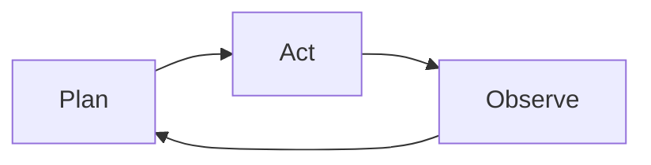

# Agentic Engineering — Opening

## From Language Models to Agents: Why We Need to Rethink Engineering Paradigms

---

## 1. A Brief History of LLMs

| Time | Milestone | Significance |
|------|--------|------|
| 2017 | **Transformer** paper *Attention Is All You Need* | Laid the architectural foundation; self-attention mechanism replaced RNN/CNN |
| 2018 | **GPT-1** / **BERT** | Pre-training + fine-tuning paradigm established; NLP benchmarks shattered |
| 2019 | **GPT-2** (1.5B) | Emergent zero-shot capability; delayed release due to being "too dangerous" |
| 2020 | **GPT-3** (175B) | **In-context learning**: no fine-tuning needed, prompts drive tasks |
| 2022 | **ChatGPT** (GPT-3.5) | RLHF aligns with human intent; large models go mainstream |
| 2023 | **GPT-4** | Multimodal, significantly improved reasoning; "emergence" becomes consensus |
| 2024 | **Claude 3.5 / o1 / Gemini 2** | Long context, tool calling, reasoning models become standard |
| 2025 | **Agent framework explosion** | MCP, Computer Use, Multi-Agent systems move to production |

> **Core trend**: Model scale growth → Emergent abilities appear → Moving from "conversation" to "action"

---

## 2. The Key Turning Point: From "Generation" to "Reasoning"

### 2.1 Emergent Abilities

When parameter count crosses a certain threshold, the model suddenly gains capabilities it didn't have before:

- **Few-shot learning**
- **Chain-of-Thought**
- **Instruction following**
- **Tool use**

This isn't gradual improvement — it's a **qualitative leap**.

### 2.2 Why Does Emergence Matter?

Emergence means: **we cannot simply extrapolate to predict the capabilities of the next generation of models.**

This directly gives rise to a new engineering problem:
> When model capabilities are unpredictable, how do we design reliable human-machine collaboration systems?

**This is the starting point of Agentic Engineering.**

---

## 3. Chain-of-Thought: Making Models "Think Slowly"

### 3.1 Two Modes of Human Thinking

Daniel Kahneman proposed in *Thinking, Fast and Slow*:

| | System 1 (Fast Thinking) | System 2 (Slow Thinking) |
|--|---|---|
| Characteristics | Intuitive, automatic, fast | Analytical, deliberate, slow |
| Example | 2+2=? | 17×24=? |
| LLM Equivalent | Direct token output | Chain-of-Thought |

### 3.2 The Essence of CoT

In 2022, the Google paper *"Chain-of-Thought Prompting Elicits Reasoning in Large Language Models"* demonstrated:

**Having the model generate intermediate reasoning steps before outputting the final answer can significantly improve accuracy on complex tasks.**

```
❌ Direct answer:
Q: A restaurant has 23 apples, used 20 for lunch, then bought 6 more. How many are left?
A: 9

✅ CoT reasoning:
Q: A restaurant has 23 apples, used 20 for lunch, then bought 6 more. How many are left?
A: The restaurant starts with 23 apples. 20 were used for lunch, so 23 - 20 = 3 remain.
   Then 6 more were bought, so now there are 3 + 6 = 9. The answer is 9.
```

### 3.3 Why Does CoT Work? — A Probabilistic Perspective

The essence of an LLM is an **autoregressive probabilistic model**: at each step of token generation, the model is estimating conditional probabilities.

Consider a problem requiring multi-step reasoning:

```
Problem A → ? → ? → Answer D
```

#### Direct Answer (No CoT)

The model needs to estimate in one step **"the probability of directly outputting D given A"**:

> **P(D | A)** — the probability that the model jumps directly to answer D having seen A

When A and D span multiple reasoning steps, their **co-occurrence frequency in training data is extremely low**. The model can hardly establish a reliable mapping from A to D in the conditional probability sense.

**Intuition**: If you've only seen "thermometer" and "fever" appear separately but rarely seen them directly linked in the same sentence, it's hard to jump directly from "thermometer reads 39°C" to "this person is sick."

#### Chain-of-Thought

The model only needs to sequentially estimate **three simple conditional probabilities, then multiply them**:

> **P(B | A) × P(C | B) × P(D | C)** — that is:
> - The probability of outputting B having seen A
> - The probability of outputting C given B is already present
> - The probability of outputting D given C is already present

The key insight: **each step's conditional probability is far higher than the probability of jumping directly.**

```
Direct:  A ──────────────────→ D     P(D|A)   very low ❌
CoT:     A → B → C → D              P(B|A)·P(C|B)·P(D|C)  each step is relatively high ✅
```

Why? Because:

- **A and B are adjacent**, they have high co-occurrence frequency in training data; the model has seen many "B follows A" patterns
- **B and C are adjacent**, same reasoning, this is a simple one-step inference
- **C and D are adjacent**, this step is also natural

Each step is a local pattern the model has "seen many times," but the global pattern spanning multiple steps may never have directly appeared in the training data.

#### Mathematical Intuition

This is consistent with the **Markov chain** concept in information theory:

> If A → B → C is a Markov chain, then using B as an intermediary allows information to be transmitted more reliably from A to C.

It can also be analogized to **numerical integration approximation**: directly estimating an integral over a wide interval has large error, but slicing it into many small intervals where each approximation is precise, and summing them up, yields accuracy.

#### Core Insight

| | Direct Answer | Chain-of-Thought |
|--|---|---|
| Probability Path | P(D\|A), one-step jump | P(B\|A)·P(C\|B)·P(D\|C), stepwise approximation |
| Difficulty Per Step | Extremely high | Low |
| Error Risk | Concentrated in one step | Distributed across multiple steps, locatable |
| Training Data Requirement | Requires A-D co-occurrence | Only requires adjacent step co-occurrence |

> **The essence of CoT is not making the model "smarter" — it's decomposing a low-probability long-distance jump into a series of high-probability short-distance steps.**

This is precisely the strategy humans use to solve problems — **we don't jump directly to the answer; we reason step by step, because each step gives us more confidence than guessing the answer outright.**

### 3.4 From CoT to Agents

CoT reveals a profound truth:

> **The reasoning process itself can be viewed as a form of "action" — each reasoning step changes the state space of the model's subsequent behavior.**

If we allow the model not only to "output text" but to "execute actions" (call tools, read/write files, search for information), CoT naturally evolves into the **Agent's reasoning-action loop**.

---

## 4. Plan Mode: The Art of Structured Reasoning

### 4.1 What is Plan Mode?

Plan Mode is an **engineering extension** of the CoT concept:

| | CoT | Plan Mode |
|--|---|---|
| Reasoning approach | Free-form, unfolds step by step | Structured, plan first then execute |
| Execution timing | Think while doing | Think clearly first, then act |
| Controllability | Lower | Higher |
| Applicable scenarios | Simple reasoning, single-step tasks | Complex engineering, multi-file modifications |

### 4.2 Why Plan Mode?

As task complexity increases, free-form CoT encounters problems:

```
Problem: Refactor the entire authentication module

❌ Execution without a Plan:
  1. Start modifying file A
  2. Discover dependency on file B, go modify B
  3. While modifying B, discover C needs updating first
  4. ...fall into infinite jumping, miss dependencies, introduce bugs

✅ Execution with Plan Mode:
  1. [Planning Phase] Analyze all dependencies, create a modification plan
     - File modification order: C → B → A
     - Scope of changes per file: ...
     - Testing strategy: ...
  2. [Execution Phase] Execute step by step according to plan
  3. [Verification Phase] Run tests to confirm
```

### 4.3 Core Values of Plan Mode

1. **Global perspective**: Understand the full picture before acting, avoiding local optima
2. **Explainability**: The plan itself is a documentation of the model's intent
3. **Interruptibility**: Humans can intervene and adjust during the planning phase, rather than remedying after the fact
4. **Reproducibility**: Explicit upfront planning makes the execution process auditable

### 4.4 The Plan → Act → Observe Cycle

Plan Mode reveals the fundamental working pattern of Agents:



> ReAct / Reason+Act Paradigm (Yao et al., 2023)

This isn't a new concept — Herbert Simon described a similar **decision-making process under bounded rationality** in his 1947 work *Administrative Behavior*.

LLMs have given this framework its first true practitioners.

---

## 5. From CoT and Plan Mode to Agentic Engineering

### 5.1 Definition

> **Agentic Engineering**: The engineering discipline of designing and building software systems with LLMs as the core reasoning engine, possessing autonomous planning and execution capabilities.

### 5.2 Core Elements

```
Agentic Engineering
├── Reasoning Layer
│   ├── Chain-of-Thought
│   ├── Plan Mode
│   └── Self-reflection / Self-correction
├── Action Layer
│   ├── Tool calling
│   ├── Code generation & execution
│   └── Computer / Browser use
├── Memory Layer
│   ├── Context window management
│   ├── External knowledge (RAG)
│   └── Session / Long-term memory
└── Collaboration Layer
    ├── Human-in-the-loop
    ├── Multi-agent orchestration
    └── MCP (Model Context Protocol)
```

### 5.3 Key Differences from Traditional Software Engineering

| Dimension | Traditional Software Engineering | Agentic Engineering |
|------|-------------|---------------------|
| Behavioral Determinism | Deterministic, input→output predictable | Probabilistic, same input may produce different output |
| Error Handling | Exception catching, pre-defined branches | Self-reflection, dynamically adjusting strategies |
| Complexity Management | Modularity, abstraction | Prompt engineering, context management, tool design |
| Testing Approach | Unit tests, integration tests | Eval frameworks, benchmark tests, human review |
| Core Challenge | How to implement functionality | How to constrain and guide non-deterministic systems |

---

## 6. Why Now?

Three converging trends make Agentic Engineering both necessary and possible:

1. **Model Capability Leaps**: CoT, reasoning models, long context — models now have the foundation for "thinking"
2. **Engineering Infrastructure Maturity**: MCP, Function Calling, Agent frameworks — the toolchain is ready
3. **Application Demand Explosion**: From coding assistants to automated workflows — real-world scenarios are calling

> **CoT taught models how to "think"; Plan Mode taught models how to "think clearly before acting."**
> **Agentic Engineering solves the problem of: how to turn "think clearly before acting" into reliable software systems.**

---

*Next, let's dive into the specific practices of Agentic Engineering...*
