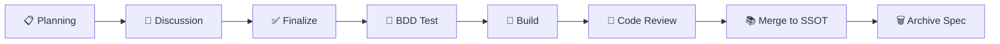

# Agent Coding 时代的仓库管理

## 核心思路

Agent Coding 正在改变仓库的组织方式。当 LLM 成为主要的代码生产者，仓库结构、文档规范和任务追踪都需要重新设计——目标是让 Agent 能**自主理解上下文、正确执行任务、可追踪可审计**。

---

## 一、Monorepo：单一大仓管理

### 为什么是 Monorepo

Agent Coding 场景下，Monorepo 的优势被放大：

| 优势 | 说明 |
|------|------|
| **统一上下文** | Agent 单次会话即可访问前后端、大数据、Agent 服务的全部代码，无需跨仓库拼凑理解 |
| **原子化修改** | 一次 API 变更可以同时修改接口定义、前端调用、数据库迁移、测试用例，由一个 PR 完成 |
| **共享 Harness** | AGENTS.md、lint 规则、CI 配置只维护一份，所有子项目自动继承 |
| **依赖可见** | 模型可以直接读取依赖图，避免跨仓库的隐性依赖导致破坏性变更 |

### 典型结构

```
monorepo/
├── apps/
│   ├── web/                # 前端应用
│   ├── api/                # 后端服务
│   ├── agent-service/      # Agent 编排服务
│   └── data-pipeline/      # 大数据 ETL
├── packages/
│   ├── shared-types/       # 共享类型定义
│   ├── auth-sdk/           # 认证 SDK
│   └── logger/             # 统一日志
├── docs/
│   ├── domains/             # 按领域划分的单一知识源
│   │   ├── order/           # 订单领域
│   │   │   ├── index.md     # 领域概览
│   │   │   ├── schema.md    # 数据模型
│   │   │   ├── state.md     # 状态机定义
│   │   │   ├── flow.md      # 业务流程
│   │   │   ├── api.md       # 接口契约
│   │   │   └── bdd.md       # 行为规格
│   │   ├── payment/         # 支付领域
│   │   └── user/            # 用户领域
│   ├── specs/               # 功能规格说明（临时，完成后归档或销毁）
│   ├── architecture.md      # 全局架构文档
│   └── conventions.md       # 编码约定
├── AGENTS.md               # Agent 全局指令
├── CLAUDE.md               # Claude 专用指令（可选）
└── nx.json / moon.yml      # monorepo 工具配置
```

### Agent 友好的 Monorepo 实践

1. **根目录放置 AGENTS.md**——Agent 进入仓库的第一入口，描述整体架构、子项目职责、依赖方向
2. **每个子项目有自己的 README**——包含该模块的边界、公开接口、本地启动命令
3. **统一的 lint + format 配置**——Agent 不需要猜测代码风格
4. **显式的依赖声明**——`package.json` 或 `Cargo.toml` 中的 workspace 依赖关系，让模型理解修改影响范围

> **反例**：Polyrepo 下，Agent 需要在多个仓库间切换上下文，每次切换都丢失会话状态。对于需要同时改 3 个仓库的 PR，Agent 几乎无法独立完成。

---

## 二、文档先行：Planning → Discussion → Finalize → BDD Test → Build

### 流程概览



这是传统软件工程的"设计先行"在 Agent 时代的强化版本。**核心差异：文档由人和 Agent 共同讨论产出，同时服务于人的理解和 Agent 的执行。** 文档即协作界面。

### 各阶段详解

#### Planning

产出一份结构化的需求文档，放在 `docs/specs/` 目录下。

```markdown
# docs/specs/user-export-v2.md

## 背景
当前用户数据导出功能只支持 CSV，用户需要 Excel 和 PDF 格式。

## 目标
- 支持 xlsx 和 pdf 导出
- 导出文件大小上限 100MB
- 异步处理，导出完成后邮件通知

## 涉及模块
- `apps/api/` — 新增导出任务队列
- `apps/web/` — 导出按钮 UI 改造
- `packages/shared-types/` — 导出任务类型定义

## 约束
- 必须复用现有队列基础设施（BullMQ）
- 文件存储使用已有的 S3 bucket
```

> Agent 可以直接读取这份文档理解任务全貌，而不是依赖模糊的自然语言指令。

#### Discussion

团队成员（人和 Agent）围绕 Planning 文档讨论，产出集中在：
- 技术方案选择和权衡
- 边界条件和异常处理
- 与现有系统的兼容性

讨论结果以注释或追加段落的形式写入 spec 文档。

#### Finalize

将讨论结论合并到 spec 中，标记为 `status: finalized`。此时文档成为 Agent 的执行蓝图。

#### BDD Test Prepare

**在写任何实现代码之前，先写测试。** 这不是 TDD 的教条，而是 Harness Engineering 的核心实践：

```gherkin
# tests/features/user-export.feature

Feature: 用户数据导出 v2

  Scenario: 导出 Excel 格式
    Given 用户有 500 条数据
    When 用户选择 "xlsx" 格式并点击导出
    Then 系统创建异步导出任务
    And 导出完成后发送邮件通知
    And 下载的文件为有效的 xlsx 格式

  Scenario: 超出大小限制
    Given 用户有超过 100MB 的数据
    When 用户点击导出
    Then 系统返回错误提示 "导出数据量过大，请缩小筛选范围"
```

> Agent 可以根据 finalized spec 直接生成 BDD 测试。测试先行意味着 Agent 在 Build 阶段有明确的验证目标——反馈回路从一开始就闭合。

#### Build

Agent 根据 spec + BDD test 进行实现。因为有明确的文档和测试，Agent 可以：
- 知道改哪些模块（spec 中已声明）
- 知道正确的输出是什么（BDD test 已定义）
- 自动运行测试验证（反馈回路自动闭合）

#### Merge into SSOT & Spec Cleanup

Build 完成、代码 Review 通过后，执行两个关键动作：

**1. 将 spec 中的知识合并到 Single Source of Truth（单一知识源）**

Spec 是临时文档，知识必须沉淀到按领域组织的持久文档中。每个领域目录维护一套标准文档：

| 文件 | 职责 | 内容示例 |
|------|------|----------|
| `index.md` | 领域概览，模块边界、核心概念、与其他领域的关系 | 订单领域包含下单、支付、履约、退款四个子域 |
| `schema.md` | 数据模型，实体定义、字段含义、约束 | Order 实体包含 items、status、totalAmount 等字段 |
| `state.md` | 状态机，状态定义、转换规则、守卫条件 | created → paid → shipped → delivered → completed |
| `flow.md` | 业务流程，端到端的业务场景描述 | 下单流程：创建订单 → 库存扣减 → 支付 → 发货 |
| `api.md` | 接口契约，API 定义、请求响应格式、错误码 | POST /api/orders，请求体、响应体、错误码枚举 |
| `bdd.md` | 行为规格，关键业务规则的行为测试 | 超时未支付自动取消、库存不足回滚等 |

为什么不是 ADR（Architecture Decision Records）？

ADR 记录的是"决策"——为什么选择了方案 A 而不是方案 B。它适合一次性记录，但**不适合作为持续更新的知识源**。Agent 需要的不是"为什么做了这个决策"，而是"当前系统是什么样子"。`index.md` + `schema.md` + `state.md` + `flow.md` + `api.md` + `bdd.md` 描述的是系统当前的真实状态，随着每次 spec 合并而持续更新。

**2. 销毁或归档 spec 文档**

Spec 完成使命后，不能留在 `docs/specs/` 中。残留的 spec 会造成信息冲突——Agent 可能读到过时的 spec 而忽略已合并到 SSOT 的最新知识。

```
# spec 生命周期
docs/specs/user-export-v2.md
    ↓ Finalize（作为执行蓝图）
    ↓ Build + Code Review 通过
    ↓ 知识已合并到 docs/domains/export/ 的各文档中
    ↓
    ✅ 彻底删除 spec 文件
    或
    📁 移至 docs/specs/_archived/（如需保留决策上下文）
```

完整流程更新为：


---

## 三、利用 Skill 承载构建知识、运维知识和可观测方法

### 问题：LLM 不知道你团队怎么做事

LLM 知道通用的最佳实践，但不知道：
- 你们团队用什么部署流程
- 你们的监控告警怎么配
- 你们的数据管道怎么跑
- 你们有哪些内部工具和约定

这些知识过去存在于：
- 老员工的脑子里
- Wiki 里过时的文档
- Slack 历史记录中

### Skill 作为知识的载体

Skill 是一种**结构化的、LLM 原生的知识容器**。它把团队特有的实践编码成 Agent 可以直接调用的指令集。

#### 例子 1：构建知识——前端发布流程 Skill

```markdown
# skill: frontend-release

## 触发条件
用户请求"发布前端"、"上线前端"、"deploy web"

## 执行步骤
1. 运行 `nx run web:build:production`
2. 检查 bundle size，如果主 chunk 超过 300KB，提示需要优化
3. 运行 `nx run web:test` 确保所有测试通过
4. 运行 `nx run web:lint` 确保无 lint 错误
5. 创建 git tag `web-v{version}`
6. 推送 tag，触发 CI/CD

## 回滚
如果发布后发现问题：
1. `git revert` 到上一个 tag
2. 重新执行步骤 1-6
```

#### 例子 2：运维知识——数据库迁移 Skill

```markdown
# skill: db-migration

## 触发条件
用户请求"加字段"、"改表结构"、"migration"

## 执行步骤
1. 在 `apps/api/src/migrations/` 下创建新的迁移文件
2. 迁移文件必须同时包含 `up` 和 `down`
3. `down` 必须能安全回滚，不能丢数据
4. 对于大表（超过 1000 万行），必须使用分批迁移策略
5. 迁移文件命名格式：`{timestamp}_{description}.ts`

## 禁止事项
- 禁止直接修改已有的迁移文件
- 禁止在迁移中引入外部 API 调用
- 禁止 `DROP COLUMN` 不带数据备份逻辑
```

#### 例子 3：可观测方法——告警配置 Skill

```markdown
# skill: alerting-setup

## 触发条件
用户请求"加告警"、"配置监控"、"设置报警"

## 执行步骤
1. 确认告警类型（错误率 / 延迟 / 吞吐量 / 饱和度）
2. 基于 SLI/SLO 框架定义指标
3. 告警阈值参考团队标准：
   - P99 延迟 > 2s → P2 告警
   - 错误率 > 1% → P1 告警
   - 错误率 > 5% → P0 告警（电话）
4. 告警路由到对应的 on-call 通道
5. 每条告警必须包含 runbook 链接

## 告警模板
...（附团队标准告警模板）
```

### Skill 的维护策略

| 实践 | 说明 |
|------|------|
| **Skill 即代码** | 放在仓库的 `.agents/skills/` 或 `.opencode/skills/` 下，随代码一起版本管理 |
| **Code Review** | Skill 的变更走 PR 审查，因为它影响所有 Agent 的行为 |
| **定期校准** | 每月检查 Skill 是否与实际流程一致，过时的 Skill 比没有 Skill 更危险 |
| **分层管理** | 通用 Skill（如 git 操作）放全局，业务 Skill（如订单流程）放项目级 |

---

## 四、任务进度落到 Markdown 追踪

### 为什么用 Markdown 而不是 Issue Tracker

| 维度 | Issue Tracker（Jira/Linear） | Markdown 文件 |
|------|-----|------|
| Agent 可访问性 | 需要集成 API，Agent 上下文中不可见 | 直接读取，零集成成本 |
| 上下文关联 | Issue 与代码分离 | 与代码在同一仓库，PR 直接引用 |
| 搜索性 | 需要 Web UI | Agent 可以 grep 全文搜索 |
| 实时性 | 状态可能滞后 | 每次 git push 都是最新状态 |

### 实现方式：任务追踪 Markdown

在 `docs/tasks/` 目录下，用 Markdown 文件追踪每个任务：

```markdown
# docs/tasks/user-export-v2.md

# 用户数据导出 v2

- **Status**: In Progress
- **Assignee**: @agent + @alice
- **Spec**: [docs/specs/user-export-v2.md](../specs/user-export-v2.md)
- **Branch**: feat/user-export-v2

## Checklist

### Planning
- [x] 需求文档编写
- [x] 涉及模块确认

### Discussion
- [x] 技术方案评审
- [ ] 性能指标确认

### Finalize
- [ ] Spec 标记为 finalized

### BDD Test
- [ ] 导出 Excel 测试用例
- [ ] 导出 PDF 测试用例
- [ ] 大文件限制测试用例

### Build
- [ ] 后端导出任务队列实现
- [ ] 前端 UI 改造
- [ ] 共享类型定义更新
- [ ] 集成测试通过

## Notes

### 2026-03-28
- 讨论确认使用 BullMQ 异步处理，不引入新依赖
- 文件存储复用现有 S3 bucket `prod-user-exports`

### 2026-04-01
- 性能指标待确认：是否需要支持并发导出？
```

### 状态驱动的追踪模式

每个任务文件的生命周期：

```
📋 Created → 🔍 Planning → 💬 Discussion → ✅ Finalized
    → 🧪 Testing → 🔨 Building → ✅ Done → 🗑️ Archived
```

状态直接写在 Markdown 文件头部，Agent 可以：
- 读取所有任务文件的 status 字段，生成进度报告
- 自动更新自己负责的 checklist 项
- 在 PR 描述中引用任务文件，实现自动关联

### 多任务视图

维护一个 `docs/tasks/README.md` 作为总览：

```markdown
# docs/tasks/README.md

# 任务看板

## In Progress
| 任务 | 负责人 | 阶段 | 更新时间 |
|------|--------|------|----------|
| [用户导出 v2](./user-export-v2.md) | @alice + agent | Build | 2026-04-01 |
| [支付回调重构](./payment-callback.md) | @bob + agent | Testing | 2026-03-30 |

## Planning
| 任务 | 负责人 | 阶段 | 更新时间 |
|------|--------|------|----------|
| [消息推送服务](./push-notification.md) | @charlie | Planning | 2026-04-02 |

## Done
| 任务 | 完成时间 | PR |
|------|----------|-----|
| [登录日志审计](./auth-audit.md) | 2026-03-25 | #142 |
```

> Agent 可以在每次会话开始时读取这个文件，了解当前所有任务的进展状态。

---

## 五、推荐工具

### Monorepo 管理

#### Nx

- **官网**：https://nx.dev
- **适合场景**：TypeScript/JavaScript 为主的技术栈，前后端统一管理
- **核心优势**：
  - 强大的依赖图分析——Agent 可以用 `nx graph` 理解模块间依赖
  - 增量构建和分布式缓存——只构建受影响的模块
  - 内置任务编排——`nx run-many --target=test --projects=affected` 批量执行
  - 插件生态丰富——Next.js、NestJS、React、Express 都有官方支持
- **Agent 友好特性**：
  - CLI 输出结构化，Agent 可解析
  - `nx show projects` 列出所有子项目
  - `nx affected` 命令让 Agent 知道一次修改影响了哪些模块

```
# 典型 nx.json 中的项目配置
{
  "targetDefaults": {
    "build": {
      "dependsOn": ["^build"],
      "outputs": ["{projectRoot}/dist"]
    },
    "test": {
      "dependsOn": ["build"]
    }
  }
}
```

#### Moonrepo

- **官网**：https://moonrepo.dev
- **适合场景**：多语言技术栈（前端 TS + 后端 Rust/Python + 大数据 PySpark）
- **核心优势**：
  - 语言无关——不像 Nx 偏向 JS 生态，moonrepo 天然支持多语言
  - 基于 hash 的增量构建——输入不变则输出复用
  - `.moon/toolchain.yml` 统一管理多语言工具版本
  - 更轻量的配置模型——每个项目只需一个 `moon.yml`
- **Agent 友好特性**：
  - `moon query projects` 列出所有项目及其依赖
  - `moon run :lint :test` 批量执行所有项目的 lint 和 test
  - 任务依赖图可导出为 JSON，Agent 可直接消费

```yaml
# apps/api/moon.yml
tasks:
  build:
    command: cargo build --release -p api
    inputs:
      - "**/*.rs"
      - "Cargo.toml"
      - "Cargo.lock"
    outputs:
      - target/release/api
  test:
    command: cargo test -p api
    deps:
      - build
```

### Spec 与任务追踪工具

#### Gemini Conductor（Google）

- **适合场景**：在 Gemini 生态中使用 Agent 进行任务编排和追踪
- **核心优势**：
  - 与 Google 生态深度集成（BigQuery、GCS、GKE）
  - 支持 Agent 任务的拆分、分配和进度追踪
  - 可以追踪多 Agent 协作的进度状态
  - 适合需要端到端追踪"从 spec 到部署"的团队

#### OpenSpec

- **官网**：https://openspec.dev
- **适合场景**：以 spec 为中心的开发流程，强调文档驱动
- **核心优势**：
  - Spec 文档即代码——放在仓库中版本管理
  - 支持 spec 的讨论、审批、变更追踪
  - 可以从 spec 自动生成 BDD 测试骨架
  - 与 CI/CD 集成，spec 状态驱动构建流程

### 工具选择建议

| 场景 | Monorepo 工具 | Spec 工具 |
|------|--------------|-----------|
| 纯 JS/TS 技术栈，前后端 + Agent 服务 | **Nx** | Gemini Conductor / OpenSpec |
| 多语言技术栈（TS + Rust + Python） | **Moonrepo** | OpenSpec |
| 小团队，快速起步 | **Nx**（轻量模式） | Markdown + 自建模板 |
| 已有 Google Cloud 基础设施 | **Nx** 或 **Moonrepo** | **Gemini Conductor** |

> **最重要的是开始，而不是选哪个。** 选定一个，把流程跑通，再根据实际痛点调整。Agent Coding 时代的工具链还在快速演化，保持轻量、可切换的架构比选对工具更重要。
