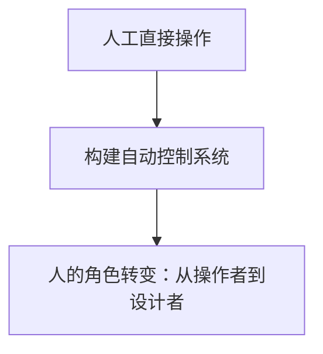
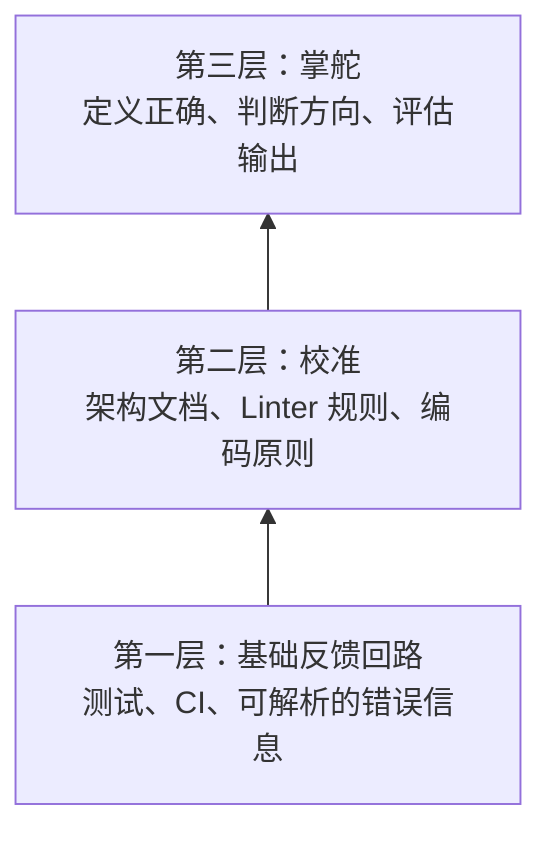
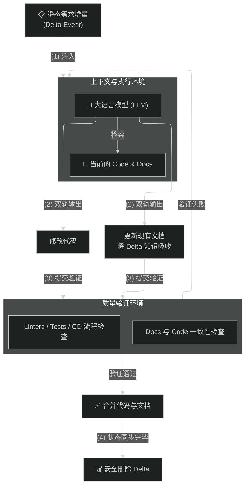

# Harness Engineering：当控制论遇见代码

## 一、三次同样的故事

### 1780 年代：瓦特调速器

蒸汽机刚发明时，需要一名工人站在旁边，手动调节阀门控制转速。工人不能走开，不能走神。

然后瓦特发明了**飞球调速器**：一个通过离心力感知转速、自动调节阀门的机械装置。

工人消失了。但产生了一个新岗位：**设计调速器的人。**

工作从"转阀门"变成了"设计让机器自己转阀门的机制"。

### 2010 年代：Kubernetes

在 K8s 之前，运维工程师手动重启崩溃的服务、手动扩缩容。K8s 做的事情很简单：

```
你声明：我需要 3 个副本
系统观测：现在只有 2 个
系统行动：自动启动第 3 个
```

工程师的工作从"重启服务"变成了"写声明文件（spec），让系统自己去维持"。

### 现在：Harness Engineering

OpenAI 描述了他们的工程团队：工程师几乎不再手写代码。他们做的是：

- 设计 Agent 的运行环境
- 构建反馈回路
- 把架构约束写成机器可读的规则

然后让 Agent 写代码。他们管这叫 **Harness Engineering（约束工程）**。

### 三个故事的共同模式



> 每次这个模式出现，都是因为有人在那一层构建了足够强的**传感器**（感知现状）和**执行器**（纠正偏差），让反馈回路可以在那个层面自动闭合。

1948 年，Norbert Wiener 给这个模式起了个名字：**控制论（Cybernetics）**。词源来自希腊语 κυβερνήτης——舵手。Kubernetes 的名字也来自同一个词。

**你不再亲自转阀门。你掌舵。**

---

## 二、代码世界里的反馈回路：已有的和缺失的

软件工程一直有反馈回路，但只在低层次运作：

| 反馈回路 | 检测什么 | 层次 |
|----------|---------|------|
| 编译器 | 语法错误 | 低 |
| Linter | 代码风格 | 低 |
| 测试套件 | 行为是否符合预期 | 低 |

这些是真正的自动控制系统——但它只能检查**可以机械化验证的属性**。能编译吗？能通过吗？符合风格规则吗？

在此之上的一切，过去没有传感器，也没有执行器：

- 这个改动符合系统架构吗？
- 这个方案是正确的方向吗？
- 这个抽象会随着代码库增长而变成负担吗？

这些问题只有人能判断。人同时充当传感器（判断质量）和执行器（写出修复）。代码世界的高层反馈回路是**断开的**。

---

## 三、LLM 改变了什么

LLM 同时改变了两侧：

**传感器侧**——模型可以理解代码的语义，判断"这个改动是否符合项目架构"、"这个抽象是否一致"。

**执行器侧**——模型可以重构模块、重写接口、围绕真正的契约重建测试套件。

> **反馈回路第一次可以在"做重要决策的层面"自动闭合。**

但闭合回路是必要条件，不是充分条件。瓦特的调速器需要调校。K8s 的控制器需要正确的 spec。而 LLM 需要更难提供的东西。

---

## 四、Harness 的两层工作

### 第一层：基础回路——让反馈跑起来

这是入场券：

- Agent 能跑的测试
- 能解析输出的 CI
- 能指向修复方案的错误信息

一个典型案例：有人用 16 个并行 Agent 构建一个 C 编译器。关键不是 prompt 写得多好，而是**精心设计的测试基础设施**。

> "我大部分精力花在设计 Claude 周围的环境上——测试、环境、反馈。"

### 第二层：校准——把你的判断变成机器能读的规则

这是真正难的地方，也是大多数人卡住的地方。

"Agent 总是做错事。它不理解我们的代码库。"

这个诊断几乎总是错的。Agent 不是能力不足，而是它需要的知识——你的系统里"好"是什么样、你的架构鼓励什么模式、避免什么模式——**锁在你的脑子里，你没有把它外化。**

Agent 不会通过渗透学习。你不写下来，第一百次运行和第一次犯同样的错。

**Harness Engineering 的核心工作，就是让你的工程判断变成机器可读的：**

- 描述真实分层和依赖方向的架构文档
- 内置修复指引的自定义 Linter 规则
- 编码团队品味的黄金原则（Golden Principles）
- AGENTS.md、CLAUDE.md、.cursorrules——这些不是锦上添花，是 Harness 本身

OpenAI 团队的教训：他们曾每周五花 20% 的时间清理"AI 生成的垃圾代码"——直到他们把标准编码进 Harness 中。

---

## 五、惩罚的量变

文档、自动化测试、架构约束编码——这些实践一直都是对的。过去三十年的工程书都推荐这么做。

大多数人跳过了，因为跳过的成本是**缓慢而分散的**：质量慢慢下降、新人入职痛苦、技术债务悄悄复利。

Agentic Engineering 让跳过的代价变得**极端**：

| 跳过的实践 | 传统代价 | Agentic 代价 |
|-----------|---------|-------------|
| 没有文档 | 慢慢跑偏 | Agent 每个 PR 都无视你的惯例，以机器速度，全天候 |
| 没有测试 | 反馈回路断开 | 反馈回路根本无法闭合 |
| 没有架构约束 | 技术债慢慢积累 | 偏差以比你修复更快的速度复利增长 |

而且有个陷阱：**你不能用 Agent 来清理 Agent 制造的混乱——如果 Agent 不知道"干净"长什么样。**

没有校准，制造问题的机器也无法解决问题。

> 实践没有变。**忽略实践的惩罚变得无法承受了。**

---

## 六、你需要比 Agent 更会什么？

生成-验证不对称（generation-verification asymmetry）：生成一个正确解比验证一个解更难。

你不需要比机器写得更快。你需要比机器**更会判断**：

- 描述"正确"长什么样
- 识别输出哪里不对
- 判断方向是否正确

设计瓦特调速器的工人没有回去手动转阀门。不是因为他们不会了，而是因为**那不再有意义了。**

---

## 七、总结

```
传统工程：人写代码，人审查代码
                ↓
Harness Engineering：人设计约束，Agent 写代码，系统自动验证

人的价值从"写"转移到"定义什么是好的写法"
```

Harness Engineering 的三层能力模型：



> **你不再写代码。你写的是让代码可以被正确写出来的环境。**
> **这就是 Harness。**

---

## 八、Harness Engineering 完整工作流：状态驱动的活文档模式


