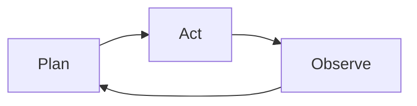

# Agentic Engineering — 开场

## 从语言模型到智能体：为什么我们需要重新思考工程范式

---

## 一、LLM 发展简史

| 时间 | 里程碑 | 意义 |
|------|--------|------|
| 2017 | **Transformer** 论文 *Attention Is All You Need* | 奠定架构基础，自注意力机制取代 RNN/CNN |
| 2018 | **GPT-1** / **BERT** | 预训练 + 微调范式确立，NLP 刷新多项基准 |
| 2019 | **GPT-2** (1.5B) | 涌现 zero-shot 能力，因"过于危险"延迟发布 |
| 2020 | **GPT-3** (175B) | **In-context learning**：无需微调，prompt 即可驱动任务 |
| 2022 | **ChatGPT** (GPT-3.5) | RLHF 对齐人类意图，大模型走向大众 |
| 2023 | **GPT-4** | 多模态、推理能力显著提升，"涌现"成为共识 |
| 2024 | **Claude 3.5 / o1 / Gemini 2** | 长上下文、工具调用、推理模型成为标配 |
| 2025 | **Agent 框架爆发** | MCP、Computer Use、Multi-Agent 系统走向生产 |

> **核心趋势**：模型规模增长 → 涌现能力出现 → 从"对话"走向"行动"

---

## 二、关键转折：从"生成"到"推理"

### 2.1 涌现能力（Emergent Abilities）

当参数量跨越某个阈值后，模型突然获得之前不具备的能力：

- **少样本学习**（Few-shot learning）
- **链式推理**（Chain-of-Thought）
- **指令遵循**（Instruction following）
- **工具使用**（Tool use）

这不是渐进式提升，而是**质的飞跃**。

### 2.2 为什么涌现很重要？

涌现意味着：**我们不能简单地用外推来预测下一代模型的能力。**

这直接催生了一个新的工程问题：
> 当模型能力不可预测时，我们如何设计可靠的人机协作系统？

**这就是 Agentic Engineering 的起点。**

---

## 三、Chain-of-Thought：让模型"慢思考"

### 3.1 人类的两种思维模式

Daniel Kahneman 在 *Thinking, Fast and Slow* 中提出：

| | System 1（快思考） | System 2（慢思考） |
|--|---|---|
| 特点 | 直觉、自动、快速 | 分析、刻意、缓慢 |
| 示例 | 2+2=? | 17×24=? |
| LLM 对应 | 直接输出 token | Chain-of-Thought |

### 3.2 CoT 的本质

2022 年，Google 论文 *"Chain-of-Thought Prompting Elicits Reasoning in Large Language Models"* 证明：

**在输出最终答案之前，让模型先生成中间推理步骤，可以显著提升复杂任务的准确率。**

```
❌ 直接回答：
Q: 餐厅有 23 个苹果，午餐用了 20 个，又买了 6 个，还有几个？
A: 9

✅ CoT 推理：
Q: 餐厅有 23 个苹果，午餐用了 20 个，又买了 6 个，还有几个？
A: 餐厅一开始有 23 个苹果。午餐用了 20 个，所以剩下 23 - 20 = 3 个。
   又买了 6 个，所以现在有 3 + 6 = 9 个。答案是 9。
```

### 3.3 CoT 为什么有效？——一个概率视角

LLM 的本质是一个**自回归概率模型**：每一步生成 token 时，模型都在估计条件概率。

考虑一个需要多步推理的问题：

```
问题 A → ? → ? → 答案 D
```

#### 直接回答（无 CoT）

模型需要一步到位估计**"给定 A，直接输出 D 的概率"**：

> **P(D | A)** — 在看到 A 的前提下，模型一步跳到答案 D 的概率

当 A 与 D 之间跨越多步推理时，两者在训练数据中的**共现频率极低**。模型很难在条件概率的意义上直接建立从 A 到 D 的可靠映射。

**直觉**：如果你只见过"温度计"和"发烧"分别出现，但很少见到它们在同一句话里直接关联，你就很难从"温度计读数 39°C"直接跳到"这个人生病了"。

#### Chain-of-Thought

模型只需要依次估计**三个简单的条件概率，再乘起来**：

> **P(B | A) × P(C | B) × P(D | C)** — 也就是说：
> - 在看到 A 的前提下，输出 B 的概率
> - 在已经有 B 的前提下，输出 C 的概率
> - 在已经有 C 的前提下，输出 D 的概率

关键在于：**每一步的条件概率都远高于直接跳跃的概率。**

```
直接：  A ──────────────────→ D     P(D|A)   很低 ❌
CoT：   A → B → C → D              P(B|A)·P(C|B)·P(D|C)  每一步都较高 ✅
```

为什么？因为：

- **A 和 B 相邻**，它们在训练语料中的共现频率高，模型见过大量"A 之后出现 B"的模式
- **B 和 C 相邻**，同理，这是一步简单推理
- **C 和 D 相邻**，这一步也很自然

每一步都是模型"见过很多次"的局部模式，但跨越多步的全局模式可能从未在训练数据中直接出现过。

#### 数学直觉

这和信息论中的**马尔可夫链**思想一致：

> 如果 A → B → C 是一条马尔可夫链，那么用 B 作为中介，可以让信息从 A 更可靠地传递到 C。

也可以类比为**积分的数值逼近**：直接估算一个宽区间上的积分误差很大，但把它切成很多小区间，每个小区间的逼近都很精确，加起来就准确了。

#### 核心洞察

| | 直接回答 | Chain-of-Thought |
|--|---|---|
| 概率路径 | P(D\|A)，一步跨越 | P(B\|A)·P(C\|B)·P(D\|C)，逐步逼近 |
| 每步难度 | 极高 | 低 |
| 错误风险 | 集中在一步 | 分散到多步，可定位 |
| 对训练数据的要求 | 需要 A-D 共现 | 只需相邻步骤共现 |

> **CoT 的本质不是让模型"更聪明"，而是将一个低概率的长距离跳跃，分解为一系列高概率的短距离步骤。**

这正是人类解决问题的策略——**我们不直接跳到答案，而是一步步推理，因为每一步都比直接猜答案更有把握。**

### 3.4 从 CoT 到 Agent

CoT 揭示了一个深刻的事实：

> **推理过程本身可以被视为一种"行动"——每一步推理都在改变模型后续行为的状态空间。**

如果我们允许模型不只是"输出文字"，而是"执行动作"（调用工具、读写文件、搜索信息），CoT 就自然演化为了 **Agent 的推理-行动循环**。

---

## 四、Plan Mode：结构化推理的艺术

### 4.1 什么是 Plan Mode？

Plan Mode 是 CoT 思想的**工程化延伸**：

| | CoT | Plan Mode |
|--|---|---|
| 推理方式 | 自由形式，逐步展开 | 结构化，先规划后执行 |
| 执行时机 | 边想边做 | 先想清楚，再动手 |
| 可控性 | 较低 | 较高 |
| 适用场景 | 简单推理、单步任务 | 复杂工程、多文件修改 |

### 4.2 为什么需要 Plan Mode？

当任务复杂度上升时，自由形式的 CoT 会遇到问题：

```
问题：重构整个认证模块

❌ 没有 Plan 的执行：
  1. 开始改文件 A
  2. 发现依赖文件 B，去改 B
  3. 改 B 时发现需要先更新 C
  4. ...陷入无限跳转，遗漏依赖，引入 bug

✅ Plan Mode 的执行：
  1. 【规划阶段】分析所有依赖关系，制定修改计划
     - 文件修改顺序：C → B → A
     - 每个文件的修改范围：...
     - 测试策略：...
  2. 【执行阶段】按计划逐步执行
  3. 【验证阶段】运行测试确认
```

### 4.3 Plan Mode 的核心价值

1. **全局视角**：在行动前理解全貌，避免局部最优
2. **可解释性**：计划本身就是对模型意图的文档化
3. **可中断性**：人类可以在规划阶段介入调整，而非事后补救
4. **可复现性**：明确的事前计划使得执行过程可审计

### 4.4 Plan → Act → Observe 循环

Plan Mode 揭示了 Agent 的基本工作模式：



> ReAct / Reason+Act Paradigm (Yao et al., 2023)

这不是新概念——Herbert Simon 在 1947 年的 *Administrative Behavior* 中就描述了类似的**有限理性下的决策过程**。

LLM 让这个框架有了真正的实践者。

---

## 五、从 CoT 和 Plan Mode 到 Agentic Engineering

### 5.1 定义

> **Agentic Engineering**：设计和构建以 LLM 为核心推理引擎、具备自主规划与执行能力的软件系统的工程学科。

### 5.2 核心要素

```
Agentic Engineering
├── 推理层（Reasoning）
│   ├── Chain-of-Thought
│   ├── Plan Mode
│   └── Self-reflection / Self-correction
├── 行动层（Action）
│   ├── Tool calling
│   ├── Code generation & execution
│   └── Computer / Browser use
├── 记忆层（Memory）
│   ├── Context window management
│   ├── External knowledge (RAG)
│   └── Session / Long-term memory
└── 协作层（Collaboration）
    ├── Human-in-the-loop
    ├── Multi-agent orchestration
    └── MCP (Model Context Protocol)
```

### 5.3 与传统软件工程的关键区别

| 维度 | 传统软件工程 | Agentic Engineering |
|------|-------------|---------------------|
| 行为确定性 | 确定性，输入→输出可预测 | 概率性，相同输入可能不同输出 |
| 错误处理 | 异常捕获，预设分支 | 自我反思，动态调整策略 |
| 复杂度管理 | 模块化、抽象 | Prompt 工程、上下文管理、工具设计 |
| 测试方式 | 单元测试、集成测试 | Eval 框架、基准测试、人工评审 |
| 核心挑战 | 如何实现功能 | 如何约束和引导非确定性系统 |

---

## 六、为什么是现在？

三个趋势的交汇使得 Agentic Engineering 成为必要且可能：

1. **模型能力跃迁**：CoT、推理模型、长上下文——模型已具备"思考"的基础
2. **工程基础设施成熟**：MCP、Function Calling、Agent 框架——工具链已就绪
3. **应用需求爆发**：从编程助手到自动化工作流——真实场景在呼唤

> **CoT 让模型学会了"想"，Plan Mode 让模型学会了"想清楚再干"。**
> **Agentic Engineering 要解决的是：如何让"想清楚再干"变成可靠的软件系统。**

---

*接下来，让我们深入 Agentic Engineering 的具体实践……*
